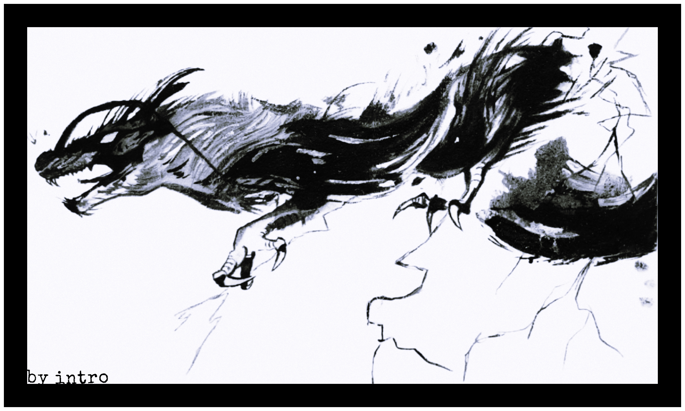
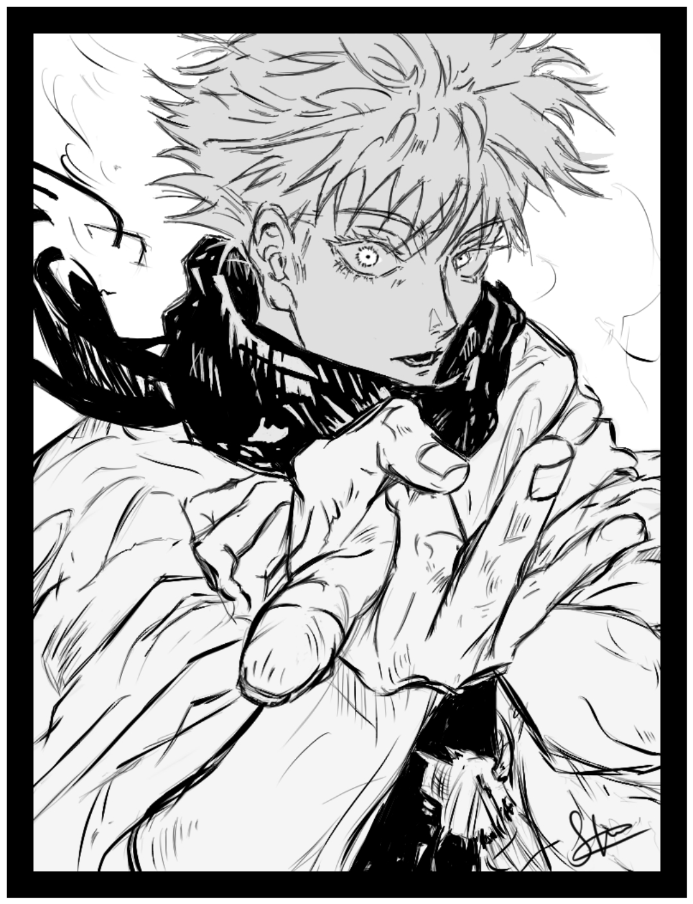

<!-- top wave banner -->


<!-- typing animation -->
<div align="center">

[](https://git.io/typing-svg)

</div>

---

<!-- about section — two column -->
<table>
<tr>
<td valign="top" width="55%">

## 🌿 hey, I'm sparsh, you can also call me Intro 

ml engineer who also draws, beatboxes, and watches way too much anime.

- 🤖 building AI/ML projects
- 🎨 digital illustration (tablet + stylus life)
- 🎤 beatboxer
- 📖 manga reader, anime watcher
- 🎵 messing around in FL Studio

🌐 **[introverto.vercel.app](https://introverto.vercel.app/)**

</td>
<td valign="top" width="45%" align="center">

<!-- 👇 REPLACE THIS URL with your own art/gif from your /assets folder -->


</td>
</tr>
</table>

---

## 🤖 what i work with

**Languages**

<p>
  
  
</p>

**ML & DL**

<p>
  
  
</p>

**LLM & RAG**

<p>
  
  
  
  
</p>

**CV & NLP**

<p>
  
  
</p>

**Infra & Deployment**

<p>
  
</p>

**Tools & Libraries**

<p>
  
  
  
  
</p>

---

## 🎨 art & music

<table>
<tr>
<td valign="top" width="50%">

**Digital Art**

<p>
  
  
  
  
</p>

</td>
<td valign="top" width="50%">

**Music & Audio**

<p>
  
  
  
</p>

</td>
</tr>

<!-- 👇 art showcase row — drop your own illustrations here -->
<tr>
<td colspan="2" align="center">

<!-- Replace src URLs with your own artwork: ./assets/art1.png etc. -->



</td>
</tr>
</table>

---

## ✨ currently into

```yaml
anime:    watching whatever's airing + backlog is infinite
manga:    always reading something
music:    FL Studio experiments + beatbox sessions
drawing:  character art, illustrations
ML:       RAG systems, fine-tuning, deployment
```

---

## 📊 github stats

<div align="center">


[](https://git.io/streak-stats)

</div>

---

## 🌐 find me

<div align="center">

[](https://introverto.vercel.app/)
[](https://github.com/sparshsaraf)

</div>

---

<div align="center">
  
  <br/><sub>thanks for stopping by 👋</sub>
</div>


